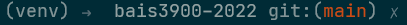

# BAIS3900-2022

Capstone project for BAIST Degree

# Setup of the project

## Technology stack 

- Django
- PostgreSql
- Python / Javascript
- Docker
- venv
- Gitlabs

## Installing Envrioment

To get started with this project you will need to have the docker engine installed locally
on your computer. If you are using windows I would suggest you use docker desktop its very
easy to use. 

After installing docker desktop you should run this script to pull a postgres server

`the script`

After pulling the project from Gitlabs you need to create a `venv` to do this on windows
run `python -m venv venv` in the root of the project. this will create a folder called
`venv`. Next activate the venv with `./venv/Scripts/Activate.ps1`. You should see some
notice in your terminal that the envrioment is active. 

Now you can update the pip repository list and pip its self with `pip install --upgrade pip`

Then please install the project requirements using `pip install -r requirements.txt`

Finally you can enter the project folder containing `manage.py` and run `python manage.py migrate`
to setup your db. After this your project should run fine using `python manage.py runserver`. 

