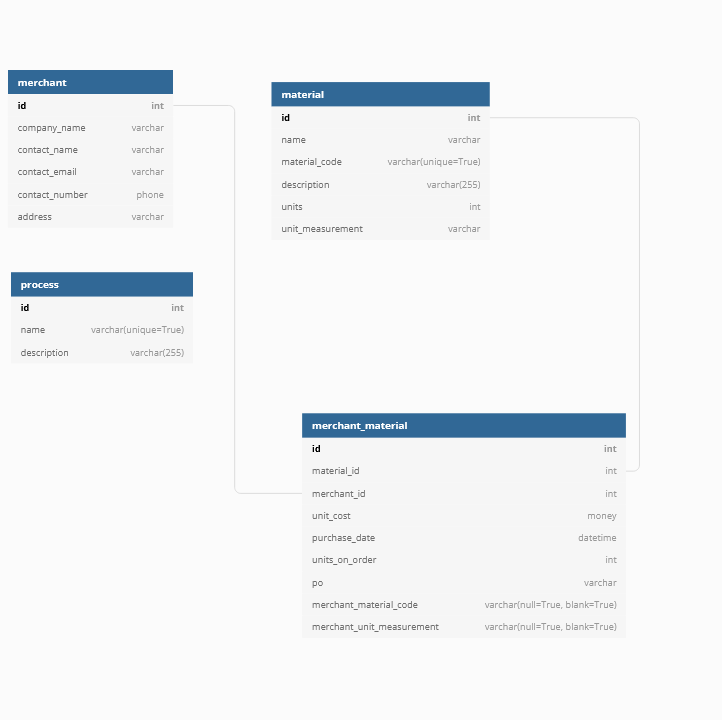

```json
Table merchant {
  id int [pk]
  company_name varchar
  contact_name varchar
  contact_email varchar
  contact_number phone
  address varchar
}

Table process {
  id int [pk]
  name varchar(unique=True)
  description varchar(255)
}

Table material {
  id int [pk]
  name varchar()
  material_code varchar(unique=True)
  description varchar(255)
  units int // how many units we have
  unit_measurement varchar // How its measured exp m2, bf, inch2 etc
  
}

Table merchant_material {
  id int [pk]
  material_id int
  merchant_id int
  unit_cost money
  purchase_date datetime
  units_on_order int
  po varchar
  merchant_material_code varchar(null=True, blank=True)
  merchant_unit_measurement varchar(null=True, blank=True) // incase the merchant sells in a different measurement then we do
}


Ref: merchant_material.merchant_id > merchant.id
Ref: merchant_material.material_id > material.id
```

